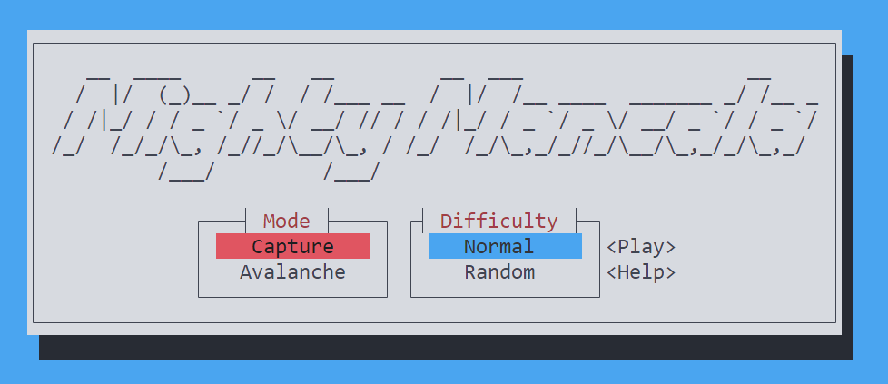
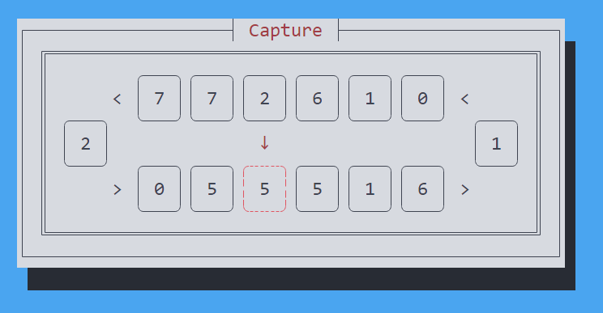

# Mighty Mancala

## About
Mighty mancala is a tui two player game, run from the command line.

Play with a friend and see who is the best at mancala

## Install
`cargo install mighty-mancala`

## Usage
run the game with 

`mancala`

Move your selection around the screen with the arrow keys.

Confirm a selection with enter.

To quit the program press q.

## Features
Mighty mancala has an easy to use text user interface. 

It also has multiple game modes to play with 
- Capture
- Avalanche

There are also diffrent difficulties to choose from
- Normal (4 stones per bowl)
- Random

There are more features to come...
- Play against a bot
- More customizable board
- Online multiplayer
- Leader boards
- and more!
